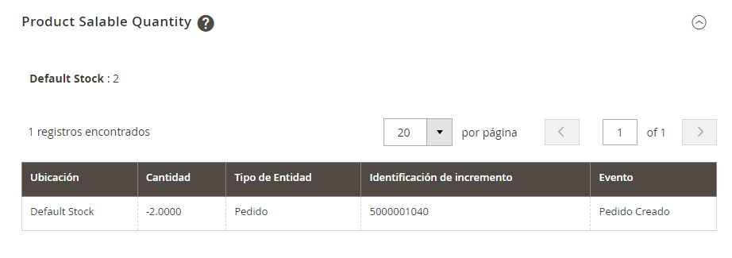

# Gento_StockReservationStatus Magento 2 module

## Usage

On product form will appear a grid with all reservation status for the current sku[^1].

[^1]: If you change the sku, the grid will be updated using the new sku to filter. To be honest, still don't know if
this is a feature or a bug.
